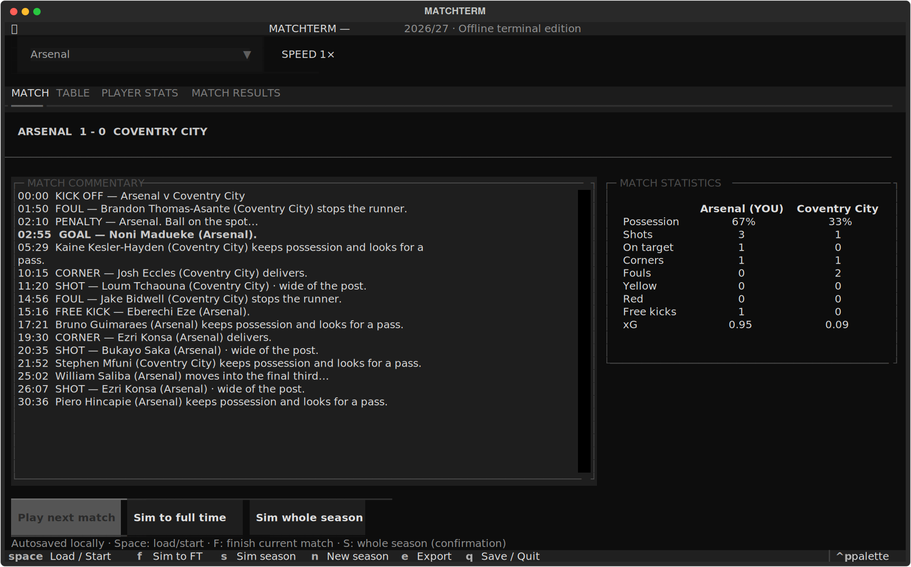
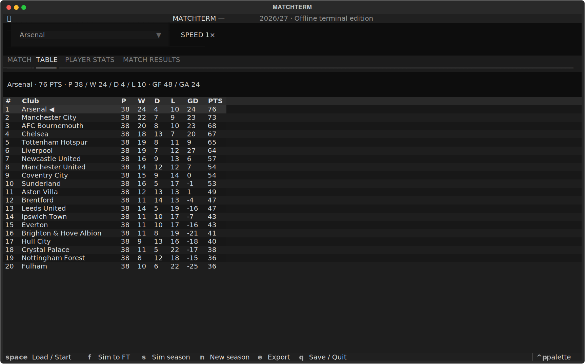
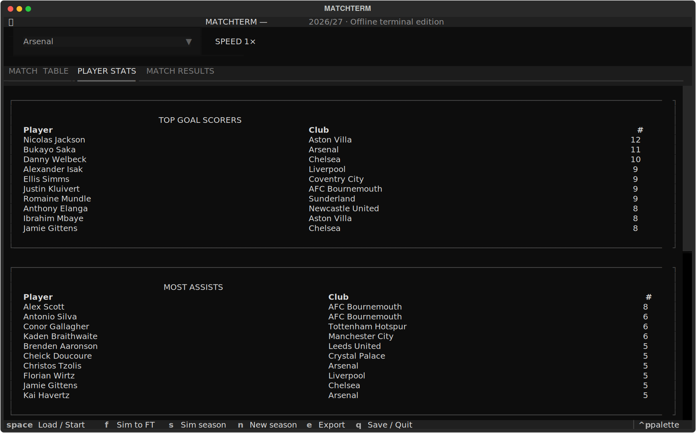

# MATCHTERM — terminal edition 0.1.2

## Install — paste into PowerShell 7

```powershell
irm https://raw.githubusercontent.com/fasaziz/matchterm/main/Install.ps1 | iex
```

This runs the public install script, installs uv if needed, downloads Python 3.12 and MATCHTERM, updates your command path, and launches the app. No standalone Windows installer or Git installation is needed. Later, run `matchterm` to play. Saves remain in `%LOCALAPPDATA%\MATCHTERM`. You can inspect [Install.ps1](Install.ps1) before running it.


A first testable offline terminal release for Windows 11, PowerShell 7 and Windows Terminal. No GitHub account or API key is required. An internet connection is needed for initial installation; normal gameplay is offline.

## Quick start

Already installed? Open PowerShell 7 and type:

```powershell
matchterm
```

Select your club, press **Space** to load a fixture, then press **Space** again to start it. Use **Left / Right** to switch views, **Up / Down** to browse, and **Q** to save and quit.

Open **README.html** for this guide with pictures. README.md contains the same information for Markdown viewers. The game runs locally; this ZIP does not publish a website or create a GitHub repository.

## Screenshots

These are captures of the actual terminal app in a test environment, with illustrative simulated results. Windows Terminal font and window styling may differ.

### Live match



### League table



### Updating an existing installation

1. Press **Q** to close the running game.
2. Extract the new release into its own folder. Do not mix installer files and wheels from different releases.
3. Double-click **Start-MATCHTERM.cmd** in the new folder.
4. Setup replaces the installed program and launches it with your existing save.

The extracted ZIP is an installation package, not your save folder. Updating does not reset your active season. The game is copied into uv's managed tool environment, so you can move or delete the extracted folder after installation. Keep it if you want the screenshots, source or installer available later.

## Player leaderboards



## Install or update on your laptop

1. Extract the entire ZIP.
2. Open the extracted `matchterm-terminal` folder.
3. Double-click **Start-MATCHTERM.cmd**.

Setup installs uv if missing, installs MATCHTERM and Python if needed, updates PATH, and launches the game in the same session. Internet is required for setup. Existing saves stay in `%LOCALAPPDATA%\MATCHTERM` when updating. The command file runs the bundled PowerShell installer with execution-policy bypass for that process only; it does not permanently change your execution policy.

For later launches, open PowerShell 7 and run `matchterm`. If you prefer terminal setup, run `pwsh -NoProfile -ExecutionPolicy Bypass -File .\Install.ps1` from this folder.

If setup reports that winget is missing, install **App Installer** from Microsoft Store and retry.

## Play

Select a club before loading your first match. **Play next match** loads the fixture without starting it; **Start match** begins the live timeline. A match takes about three minutes at 1×. Results are locked for that season. Quitting and reopening resumes the same match and unrevealed events; it does not advance while closed.

| Key | Action |
| --- | --- |
| Space | Load next fixture / start match |
| F | Simulate the current fixture to full time |
| S | Simulate the remaining season, after confirmation |
| 1 / 2 / 4 | Change speed |
| N | Start a fresh season after completion |
| E | Export the current season as JSON |
| Q | Save and quit |
| Left / Right | Switch between Match, Table, Player Stats and Match Results |
| Up / Down | Scroll content; Up at the top returns to the navigation bar, Down enters content |
| Page Up / Page Down | Scroll by a page |
| Tab / Shift+Tab | Move between controls |
| Enter | Activate the focused control |
| Escape | Cancel confirmation |

The tabs show live commentary, league standings, goals/assists/yellow/red leaderboards, and all committed league results. Click a saved result row to inspect its commentary. For comfortable display, use at least 120 columns and 35 rows; maximise Windows Terminal or reduce its font size. At small sizes keyboard shortcuts are available even if some buttons are clipped.

## What each tab shows

| Tab | Contents | Navigation |
| --- | --- | --- |
| Match | Current fixture, clock, named commentary and team-labelled statistics | Up / Down scroll commentary |
| Table | Standings for all 20 clubs and your club's record | Up / Down move through rows |
| Player Stats | Top ten players for goals, assists, yellow cards and red cards | Up / Down scroll through the four lists |
| Match Results | Every committed league result, including other clubs | Up / Down select rows; Enter opens saved commentary |

Left / Right switches tabs from the view or navigation bar. Press Up at the top of a list to return focus to the navigation bar. Press Down from the bar to enter the selected view. Within the club selector, arrows select clubs instead; finish the selection with Enter. A saved-commentary window closes with Escape or its Close button.

## How a season works

- There are 20 clubs and 380 fixtures; each club has 19 home and 19 away matches.
- Loading a fixture prepares its events but waits for kickoff. After your first fixture is loaded, club selection is locked for that run.
- Start Match plays the timeline progressively. Statistics change as events are revealed.
- Sim to full time finishes the current fixture using its existing locked events; it cannot reroll the outcome.
- Sim whole season asks for confirmation. Cancel leaves the season untouched. Continue completes all remaining league fixtures and keeps results already recorded.
- Other clubs' preceding fixtures are simulated when your match finishes. Consequently, interim table rows may show different numbers of matches played.
- At completion, review the final table, player leaders and all match results. New season creates a fresh run of the same bundled 2026/27 schedule; it does not fetch a new real-world season.
- Older seasons remain in the database, but reopening them through an archive screen is not yet supported.

Goals favour the forward pool. Assists favour creative players, and card events are assigned to named players. These are simplified simulation weights. Possession is estimated from simulated possession events, and xG is the sum of modelled shot probabilities; neither is measured real-world data. Some goals have no assist, including penalties. A second yellow is counted as both a yellow-card event and a dismissal.

## Your local files

Paste this into the File Explorer address bar:

```text
%LOCALAPPDATA%\MATCHTERM
```

- `seasons.sqlite3`: all seasons, including the active game.
- `seasons-backup.sqlite3`: backup taken before starting a fresh season.
- `season-<number>.json`: files created with E (Export).

The database saves periodically and after match events. Close with Q for an immediate clean save. A sudden process kill may lose up to roughly one second of clock progress but not reroll the locked events. Older seasons are retained when starting a new one, but this first release does not yet have an archive selection screen. Updates and uninstalling the app do not intentionally delete saves. For a manual backup, close the game and copy the entire save folder. Open it directly with:

```powershell
matchterm --open-save-folder
```

Browser seasons are separate and are not imported into this edition. Run one app window per save folder. Conflicting saves from another window are rejected instead of overwritten. A separate test save location is supported:

```powershell
matchterm --save-folder "$env:USERPROFILE\Documents\MATCHTERM-Test"
```

## Backups, exports and restoring

**Backup:** quit with Q, then copy the entire `%LOCALAPPDATA%\MATCHTERM` folder to a safe location. SQLite may create `seasons.sqlite3-wal` and `seasons.sqlite3-shm` while the app is running; copying the full folder after closing is safer than copying an open database alone.

**Automatic backup:** `seasons-backup.sqlite3` is refreshed before starting a new season. It is one rolling backup, not a separate backup for every match or season.

**Export:** press E to write `season-<number>.json` into the save folder. Export includes the current season state, committed results, commentary and player totals. Exporting the same season again replaces that season's existing JSON export. JSON import is not yet supported, so retain the database for resuming play.

**Restore a manual folder backup:** close every MATCHTERM window. Rename the current save folder to `MATCHTERM-before-restore`, then copy the backed-up folder into the original `%LOCALAPPDATA%\MATCHTERM` location. Launch the game. Keep the renamed folder until you have confirmed the restored season is correct.

**Restore the automatic database backup:** close the app and copy the full current folder somewhere safe first. Create a fresh `MATCHTERM` save folder containing a copy of `seasons-backup.sqlite3` renamed to `seasons.sqlite3`, then launch. Do not carry old WAL/SHM files into the restored folder.

For privacy, gameplay and saves remain local. No account, API key or cloud save service is used. Installing prerequisites connects to package download services. A custom save folder inside OneDrive or another synced directory follows that directory's own syncing rules. Saves are not shared between laptops automatically.

## Storage estimates

| Item | Approximate measured size |
| --- | --- |
| Fresh season database | 16 KB |
| Mid-match database | 24 KB |
| Complete season database with 380 match logs | 3.3 MB |
| Full-season JSON export | 4.9 MB |

Sizes vary with events and player names. Retained seasons increase database size, and the rolling backup can approximately double database storage. Exports are additional files. There is no season-deletion interface in this release.

## Troubleshooting

| Problem | What to do |
| --- | --- |
| `matchterm` is not recognised | Run Start-MATCHTERM.cmd again. It updates PATH for its own session and launches directly. For a manually opened PowerShell session, use the commands below. |
| `uv` is not recognised | Use the bundled setup, which checks for uv and installs it via winget. |
| winget is missing | Install Microsoft's App Installer from Microsoft Store, then run setup again. |
| The release wheel is missing | Extract the entire ZIP and run the launcher beside Install.ps1. Do not run it from inside the ZIP preview. |
| Installation fails during downloads | Check your connection and retry setup. Copy the full error text if it continues. |
| Buttons or rows are clipped | Maximise Windows Terminal or reduce font size. Aim for at least 120 columns and 35 rows. |
| Arrows do not scroll the list | Finish any open club selector or dialog with Enter/Escape. Return to the desired tab and press Down to enter its content. |
| Save conflict from another window | Close the duplicate window and reopen one instance. The conflict guard prevents overwriting another session's changes. |
| A save error or unsupported schema appears | Keep the database intact and copy the error text. Do not delete it as a troubleshooting step. |

If the app installed successfully but a separate shell still cannot find it, run:

```powershell
$toolBin = (uv tool dir --bin | Out-String).Trim()
$env:PATH = "$toolBin;$env:PATH"
matchterm
```

For help, provide the app version, PowerShell version (`$PSVersionTable.PSVersion`), the action you were taking and the full error text. A screenshot of the terminal can help with layout issues. Avoid including private exports unless they are needed to investigate your save.

## Uninstall

Close MATCHTERM, then run:

```powershell
uv tool uninstall matchterm
```

This removes the installed app. Your save folder and downloaded/extracted release files remain. Keep a backup before manually removing saves.

## Scope and validation

The release has been tested in a Linux environment using Python 3.12 and Textual 1.0.0, including automated terminal UI interaction, confirmation cancellation, mid-match save/resume, full-season totals and reset. Installation and arrow-key navigation have also been confirmed by the user on Windows 11 with PowerShell 7.6.6 and Windows Terminal. The automated tests themselves ran on Linux, not Windows. This is a first test release, not a completed commercial release.

Fixtures and squads are bundled snapshots from the browser prototype's official Premier League sources. No live data updates happen during play:

- https://www.premierleague.com/en/news/4675097/all-380-fixtures-for-202627-premier-league-season
- https://www.premierleague.com/en/news/4725682/all-20-premier-league-clubs-squad-numbers-for-202627-season

Names and fixtures are real snapshot data; ratings, events and results are fictional. Forward/goalkeeper pools and simplified remaining role weights are illustrative, not an authoritative tactical database. Sent-off players are excluded from later events in that match; suspensions across matches, real lineups, injuries, transfers and substitutions are not modelled in this release. League tie-breaking uses points, goal difference, goals scored, then alphabetical order for unresolved ties.

## Development / Git

The ZIP includes source, package metadata and tests, ready to put into your own private repository. No remote repository has been created. Keep saves and exports out of Git. Install from source with `uv tool install --python 3.12 .` or create a development environment with `uv venv`, then `uv pip install -e .`.

Run engine tests: `python -m unittest discover -s tests -p test_engine.py`
Run terminal UI tests: `python tests/test_ui.py`

Rebuild the wheel: `python -m pip wheel --no-deps --wheel-dir releases .`

